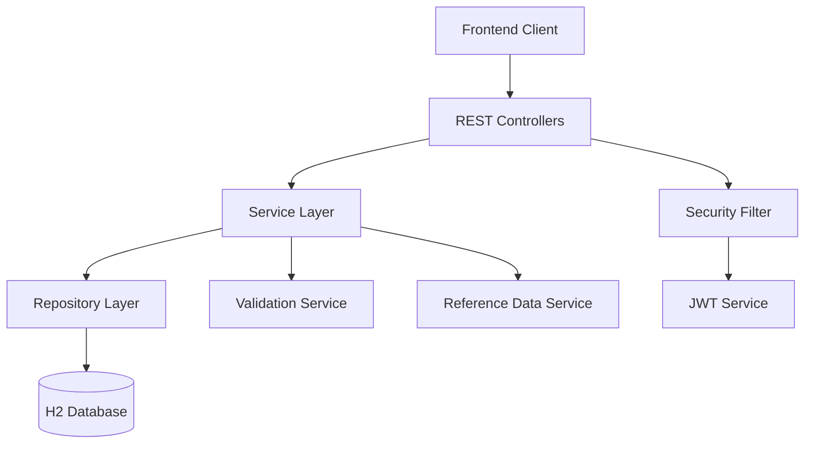

# LoadLogic Job Coordination System - Design Document

## Overview

LoadLogic is a Spring Boot-based REST API application that provides construction yard job coordination capabilities. The system implements role-based access control with JWT authentication and follows a layered architecture pattern with clear separation between presentation, business logic, and data access layers.

## Architecture

### High-Level Architecture



### Technology Stack

- **Framework**: Spring Boot 3.x with Kotlin
- **Language**: Kotlin 1.9+
- **Security**: Spring Security with JWT
- **Database**: H2 (in-memory for development)
- **ORM**: Spring Data JPA
- **Build Tool**: Gradle with Kotlin DSL
- **JVM Version**: 17+

## Components and Interfaces

### 1. Security Layer

#### JWT Authentication Service
```kotlin
@Service
class JwtService {
    // Token generation, validation, and extraction
    fun generateToken(userDetails: UserDetails): String
    fun isTokenValid(token: String, userDetails: UserDetails): Boolean
    fun extractUsername(token: String): String
}
```

#### Security Configuration
- JWT-based stateless authentication
- Role-based endpoint protection
- CORS configuration for frontend integration
- Password encoding with BCrypt

### 2. Controller Layer

#### AuthController
- `POST /api/auth/register` - User registration
- `POST /api/auth/login` - User authentication

#### JobController
- `POST /api/jobs` - Create job (CHIEF only)
- `GET /api/jobs` - Get all jobs (CHIEF only)
- `GET /api/jobs/mine` - Get assigned jobs (DRIVER/CREW)
- `GET /api/jobs/{id}` - Get job details
- `PATCH /api/jobs/{id}/status` - Update job status

#### ReferenceController
- `GET /api/reference/materials` - Get materials list
- `GET /api/reference/equipment` - Get equipment list
- `GET /api/users/available` - Get available users by role

### 3. Service Layer

#### UserService
- User registration and validation
- User authentication
- Role-based user queries

#### JobService
- Job creation and validation
- Job assignment logic
- Status update management
- Authorization checks for job access

#### ReferenceDataService
- Predefined materials and equipment management
- Available user queries

### 4. Repository Layer

#### UserRepository
```kotlin
@Repository
interface UserRepository : JpaRepository<User, Long> {
    fun findByUsername(username: String): User?
    fun findByRoleAndIsActiveTrue(role: Role): List<User>
    fun existsByUsername(username: String): Boolean
}
```

#### JobRepository
```kotlin
@Repository
interface JobRepository : JpaRepository<Job, Long> {
    fun findByAssignedDriverUsernameOrAssignedCrewUsername(driver: String, crew: String): List<Job>
    fun findAllByOrderByCreatedAtDesc(): List<Job>
}
```

## Data Models

### User Entity
```kotlin
@Entity
@Table(name = "users")
data class User(
    @Id
    @GeneratedValue(strategy = GenerationType.IDENTITY)
    val id: Long = 0,
    
    @Column(unique = true, nullable = false)
    val username: String,
    
    @Column(nullable = false)
    val fullName: String,
    
    @Column(nullable = false)
    val password: String,
    
    @Enumerated(EnumType.STRING)
    @Column(nullable = false)
    val role: Role,
    
    @Column(nullable = false)
    val isActive: Boolean = true,
    
    @Column(nullable = false)
    val createdAt: LocalDateTime = LocalDateTime.now()
)
```

### Job Entity
```kotlin
@Entity
@Table(name = "jobs")
data class Job(
    @Id
    @GeneratedValue(strategy = GenerationType.IDENTITY)
    val id: Long = 0,
    
    @Column(nullable = false)
    val title: String,
    
    @Column(nullable = false)
    val materialType: String,
    
    @Column(nullable = false)
    val quantity: String,
    
    @Column(nullable = false)
    val destinationAddress: String,
    
    @Column(nullable = false)
    val contactPerson: String,
    
    @Column(nullable = false)
    val contactPhone: String,
    
    @Column(nullable = false)
    val assignedDriverUsername: String,
    
    @Column(nullable = false)
    val assignedCrewUsername: String,
    
    @Column(nullable = false)
    val assignedEquipment: String,
    
    @Enumerated(EnumType.STRING)
    @Column(nullable = false)
    var status: JobStatus = JobStatus.PENDING,
    
    @Column(nullable = false)
    val createdByChief: String,
    
    @Column(nullable = false)
    val createdAt: LocalDateTime = LocalDateTime.now(),
    
    @Column(nullable = false)
    var updatedAt: LocalDateTime = LocalDateTime.now()
)
```

### Enums
```kotlin
enum class Role {
    CHIEF, DRIVER, CREW
}

enum class JobStatus {
    PENDING, IN_PROGRESS, COMPLETED, CANCELLED
}
```

## Error Handling

### Global Exception Handler
```kotlin
@RestControllerAdvice
class GlobalExceptionHandler {
    // Handle validation errors
    // Handle authentication/authorization errors
    // Handle resource not found errors
    // Handle business logic violations
}
```

### Custom Exceptions
- `UserNotFoundException`
- `JobNotFoundException`
- `UnauthorizedAccessException`
- `InvalidJobAssignmentException`
- `DuplicateUsernameException`

### Error Response Format
```json
{
    "timestamp": "2024-01-01T10:00:00",
    "status": 400,
    "error": "Bad Request",
    "message": "Username already exists",
    "path": "/api/auth/register"
}
```

## Security Design

### JWT Token Structure
- **Header**: Algorithm and token type
- **Payload**: Username, role, issued at, expiration
- **Signature**: HMAC SHA256 with secret key

### Authorization Matrix
| Endpoint | CHIEF | DRIVER | CREW |
|----------|-------|--------|------|
| POST /api/jobs | ✓ | ✗ | ✗ |
| GET /api/jobs | ✓ | ✗ | ✗ |
| GET /api/jobs/mine | ✗ | ✓ | ✓ |
| GET /api/jobs/{id} | ✓ | ✓* | ✓* |
| PATCH /api/jobs/{id}/status | ✓ | ✓* | ✓* |

*Only for assigned jobs

### Validation Rules
- Username uniqueness validation
- Role-based assignment validation (Driver must have DRIVER role)
- Material type validation against predefined list
- Equipment validation against predefined list
- Job access authorization based on assignment

## Testing Strategy

### Unit Testing
- Service layer business logic testing
- Repository layer data access testing
- JWT service token operations testing
- Validation logic testing

### Integration Testing
- Controller endpoint testing with MockMvc
- Security configuration testing
- Database integration testing
- End-to-end authentication flow testing

### Test Data Management
- Use @TestConfiguration for test-specific beans
- Create test fixtures for common entities
- Use @Sql for database state setup
- Mock external dependencies where appropriate

## Configuration Management

### Application Properties
```yaml
# Database Configuration
spring:
  datasource:
    url: jdbc:h2:mem:loadlogic
    driver-class-name: org.h2.Driver
  jpa:
    hibernate:
      ddl-auto: create-drop
    show-sql: true

# JWT Configuration
jwt:
  secret: ${JWT_SECRET:loadlogic-secret-key}
  expiration: 86400000 # 24 hours in milliseconds

# Reference Data
app:
  materials:
    - Sand
    - Gravel
    - Concrete
    - Bricks
    - Steel
    - Wood
  equipment:
    - Truck-01
    - Truck-02
    - Excavator-A
    - Loader-B
    - Crane-X
```

### Environment-Specific Configuration
- Development: H2 in-memory database
- Production: External database configuration
- Test: Separate test database configuration

## API Documentation

### OpenAPI/Swagger Integration
- Automatic API documentation generation
- Interactive API testing interface
- Request/response schema documentation
- Authentication flow documentation

### Response Formats
All API responses follow consistent JSON structure:
```json
{
    "success": true,
    "data": { /* response data */ },
    "message": "Operation completed successfully"
}
```

Error responses:
```json
{
    "success": false,
    "error": {
        "code": "VALIDATION_ERROR",
        "message": "Invalid input data",
        "details": ["Username is required"]
    }
}
```